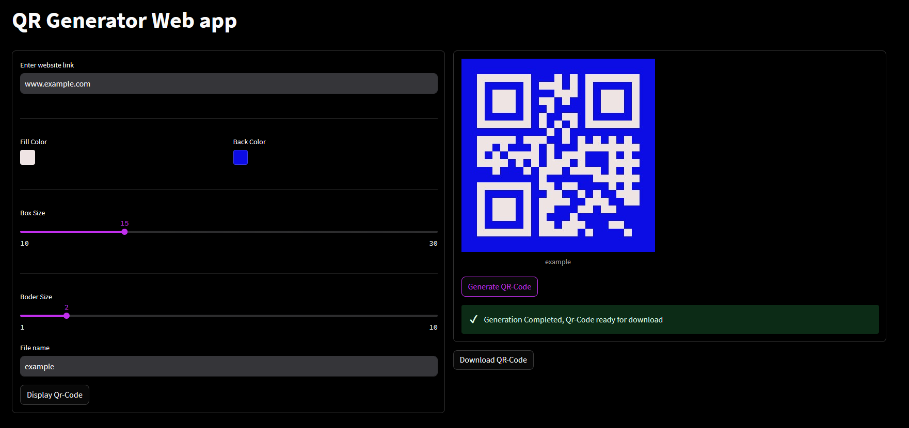
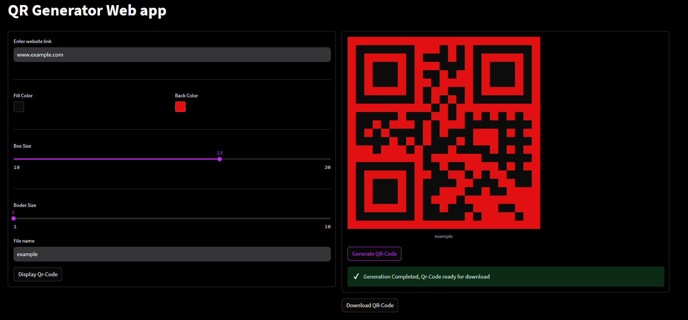
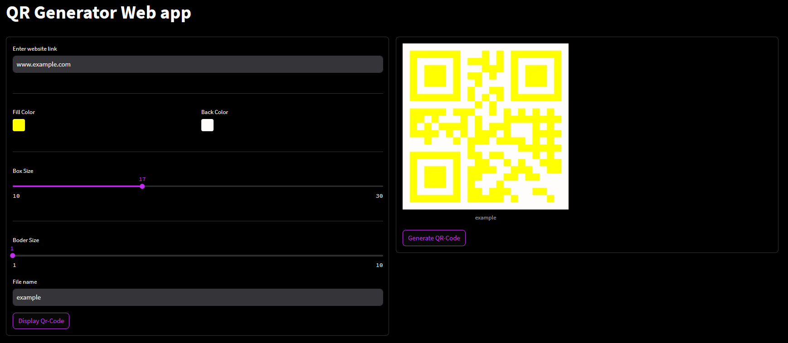
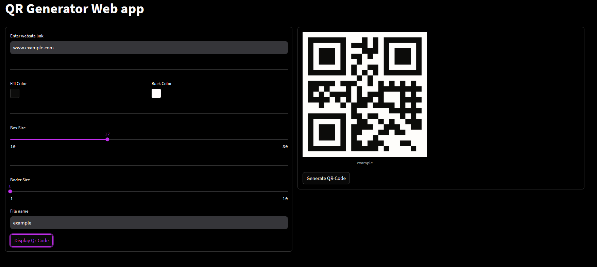

# QR-Code Generator 
## App Link : [QR Code Generator](https://qr-generator.streamlit.app/)


### Description
This Streamlit Web Application addresses the common, everyday task of generating QR codes, which are used for a multitude of purposes such as business cards and online shops. Its quick and efficient functionality ensures that users can create functional QR codes in a matter of seconds.

Notably, the application offers a valuable feature: the ability to generate, save, and download QR codes as PNG images. This functionality is crucial for users who need to store their QR codes for later use, whether it's for print materials, digital platforms, or any other situation where immediate access to the QR code is necessary.

## Screenshots 




# Required packages
- Streanmlit
-  qrcode

## Installation
To install the required packages, you can run:

```bash
 pip install -r requirements.txt

```
# How to run the app Locally 
I'd encourage you to clone this repository, check the source code behind the web app and modify it to your liking as it offers much more customizations 
1. Clone or download the repository
2. Open terminal in the folder where the files are located
3. Run `streamlit run main.py`

## Known issues (Work in progress)
- Download button should be placed within the form, not outside 
- These QR Codes are not guaranteed to work with all readers, so do some
experimentation especially with the colors combination.

Example:

    -White and Yellow ⛔

    -White and Black ✅


## Incoming
- Download option :
    * PNG 
    * SVG 


## find a bug ?
If you notice an issue or would like to submit an improvement to this project, please submit it using the tab above


